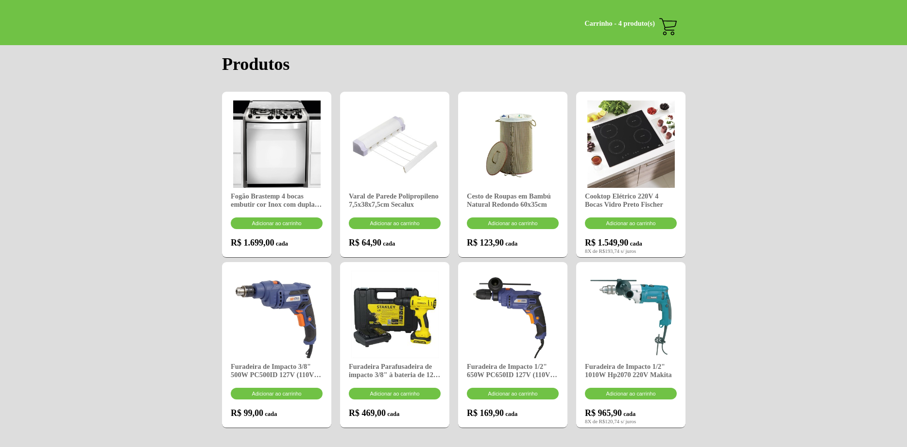
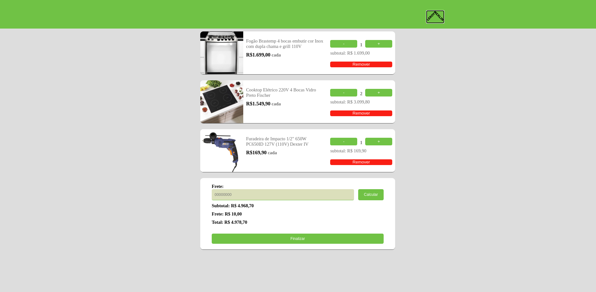
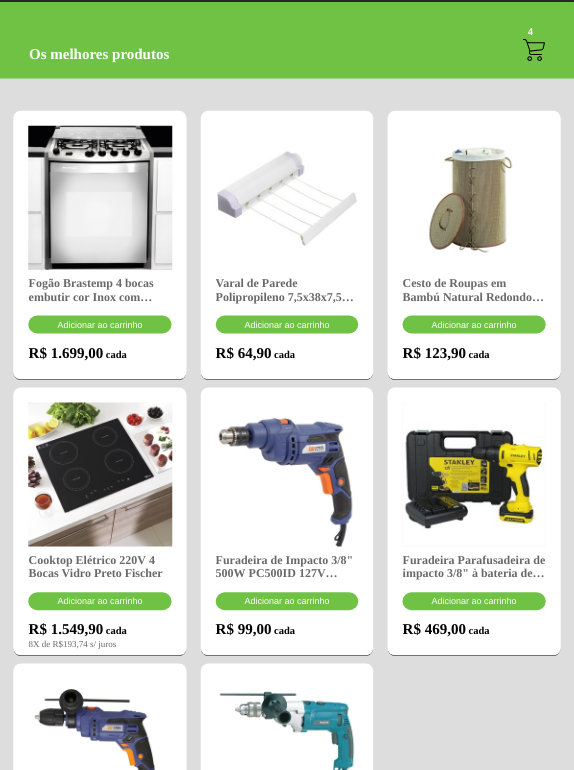
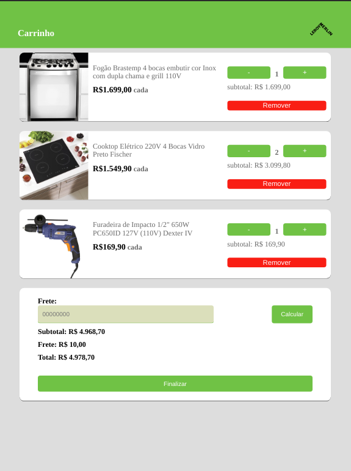
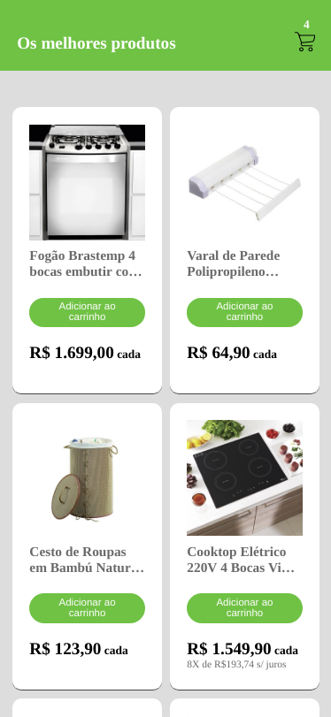
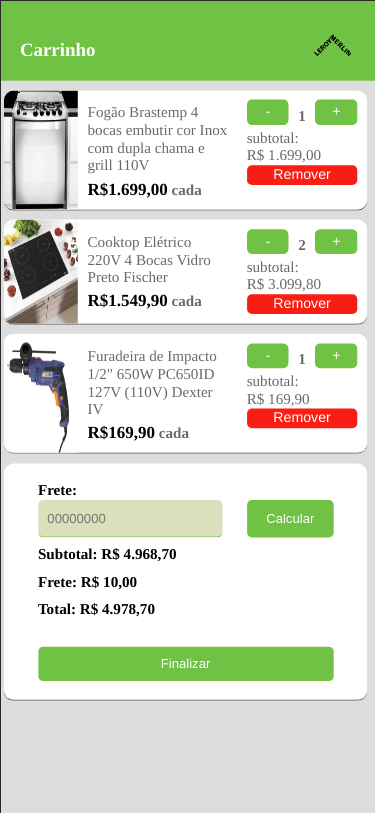

### O projeto

O lm online store é uma simulação de uma loja online que foi desenvolvida com novos conceitos de arquitetura de projeto, boas práticas de código e utilização de duck patterns para estuturação do redux store

## 🔖 Layout

#### Desktop
<h1 align="center">
    
    
</h1>

#### Tablet
<h1 align="center">
    
    
</h1>

#### Smart phone
<h1 align="center">
    
    
</h1>

## 🚀 Tecnologias

Esse projeto foi desenvolvido com as seguintes tecnologias:

- [React](https://github.com/facebook/react)
- [Redux](https://redux.js.org/)
- [React-redux](https://react-redux.js.org)
- [Redux Persist](https://www.npmjs.com/package/redux-persist)
- [React-saga](https://redux-saga.js.org)
- [ReduxSauce](https://www.npmjs.com/package/reduxsauce)
- [Styled Components](https://styled-components.com/)
- [Axios](https://github.com/axios/axios)
- [React-router-dom](https://www.npmjs.com/package/react-router-dom)
- [Immer](https://www.npmjs.com/package/immer)
- [Reacj-input-masked](https://www.npmjs.com/package/react-input-mask)
- [Reactjs-popup](https://www.npmjs.com/package/reactjs-popup)

## 🏃‍♂️ Instalando o projeto

- Clone ou baixe o repositório.
- `yarn` para instalar todas as dependências.
- `yarn start` para incializar o Metro Bundler.

